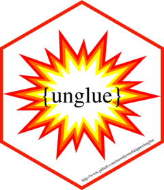

<!-- badges: start -->
[](https://travis-ci.org/moodymudskipper/unglue)
[](https://codecov.io/github/tidyverse/glue?branch=master)

```{r, include = FALSE}
knitr::opts_chunk$set(
  collapse = TRUE,
  comment = "#>",
  fig.path = "man/figures/README-",
  out.width = "100%"
)
```

# unglue 


The package *unglue* features functions such as `unglue()`, `unglue_data()` and
`unglue_unnest()` which provide in many cases a more readable alternative to
base regex functions. Simple cases indeed don't require regex knowledge at all.

It uses a syntax inspired from the functions of Jim Hester's *glue* package to 
extract matched substrings using a pattern, but is not endorsed by the authors 
of *glue* nor *tidyverse* packages.

It is completely dependency free, though formula notation of functions is
supported if *rlang* is installed.

## Installation:

```{r,eval=FALSE}
remotes::install_github("moodymudskipper/unglue")
```

### using an example from `?glue::glue` backwards

```{r}
library(unglue)
library(glue)
library(magrittr)
library(utils)
glued_data <- head(mtcars) %>% glue_data("{rownames(.)} has {hp} hp")
glued_data
unglue_data(glued_data, "{rownames(.)} has {hp} hp")
```

### use several patterns, the first that matches will be used

```{r}
facts <- c("Antarctica is the largest desert in the world!",
"The largest country in Europe is Russia!",
"The smallest country in Europe is Vatican!",
"Disneyland is the most visited place in Europe! Disneyland is in Paris!",
"The largest island in the world is Green Land!")
facts_df <- data.frame(id = 1:5, facts)

patterns <- c("The {adjective} {place_type} in {bigger_place} is {place}!",
            "{place} is the {adjective} {place_type=[^ ]+} in {bigger_place}!{=.*}")
unglue_data(facts, patterns)
```

Note that the second pattern uses some regex, regex needs to be typed after an
`=` sign, if its has no left hand side then the expression won't be attributed 
to a variable. in fact the pattern `"{foo}"` is a shorthand for `"{foo=.*?}"`.

### escaping characters

Special characters outside of the curly braces should not be escaped.

```{r}
sentences <- c("666 is [a number]", "foo is [a word]", "42 is [the answer]", "Area 51 is [unmatched]")
patterns2 <- c("{number=\\d+} is [{what}]", "{word=\\D+} is [{what}]")
unglue_data(sentences, patterns2)
```

### type conversion

In order to convert types automatically we can set `convert = TRUE`, in the example above the column `number` will be converted to numeric.

```{r}
unglue_data(sentences, patterns2, convert = TRUE)
```

`convert = TRUE` triggers the use of `utils::type.convert` with parameter
`as.is = TRUE`. We can also set `convert` to another conversion function such
as `readr::type_convert`, or to a formula is *rlang* is installed.

### `unglue_unnest()`

`unglue_unnest()` is named as a tribute to `tidyr::unnest()` as it's equivalent
to using sucessively `unglue()` and `unnest()` on a data frame column. It is
similar to `tidyr::extract()` in its syntax and efforts were made to make it as
consistent as possible.

```{r}
unglue_unnest(facts_df, facts, patterns)
unglue_unnest(facts_df, facts, patterns, remove = FALSE)
```

### `unglue_vec()`

While `unglue()` returns a list of data frames, `unglue_vec()` returns a character
vector (unless `convert = TRUE`), if several matches are found in a string the
extracted match will be chosen by name or by position.

```{r}
unglue_vec(sentences, patterns2, "number")
unglue_vec(sentences, patterns2, 1)
```

### `unglue_detect()`

`unglue_detect()` returns a logical vector, it's convenient to check that the
input was matched by a pattern, or to subset the input to take a look at
unmatched elements.

```{r}
unglue_detect(sentences, patterns2)
subset(sentences, !unglue_detect(sentences, patterns2))
```

### `unglue_regex()`

`unglue_regex()` returns a character vector of regex patterns, all over functions
are wrapped around it and it can be used to leverage the *unglue* in other
functions.

```{r}
unglue_regex(patterns)
unglue_regex(patterns, named_capture = TRUE)
unglue_regex(patterns, attributes = TRUE)
```

### `unglue_sub()`

`unglue_sub()` substitute substrings using strings or replacement functions

```{r}
unglue_sub(
  c("a and b", "foo or BAR"),
  c("{x} and {y}", "{x} or {z}"),
  list(x= "XXX", y = toupper, z = ~tolower(.)))
```


### duplicated labels

We can ensure that a pattern is repeated by repeating its label

```{r}
unglue_data(c("black is black","black is dark"), "{color} is {color}")
```

We can change this behavior by feeding a function to the `multiple` parameter,
in that case this function will be applied on the matches.

```{r}
unglue_data(c("System: Windows, Version: 10","System: Ubuntu, Version: 18"), 
            "System: {OS}, Version: {OS}", multiple = paste)
```
